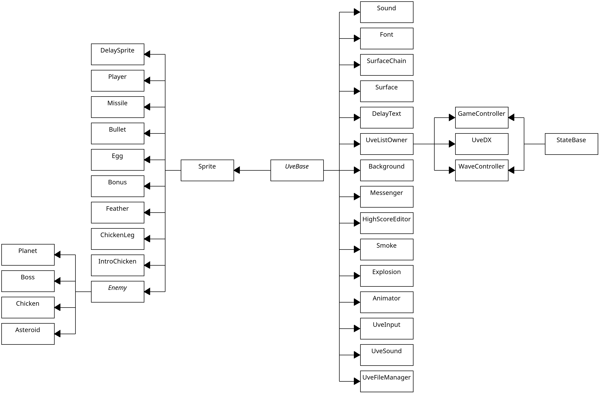

# Classes

> **Note**: All class names referenced in this documentation are inferred from residual Borland RTTI (Run-Time Type Information) data found within the binary.

Below is an overview of all identified classes used in the game. For each class, the table includes its original allocated size (when available) and its current size as reconstructed in this decompilation effort (these sizes refer to the reverse-engineered representations, not the classes used in this project):

|      Class      | Allocated size | Current size |
| :-------------: | :------------: | :----------: |
|    Animator     |      N/A       |     0x48     |
|    Asteroid     |      0xCC      |     0xCC     |
|   Background    |      0x24      |     0x24     |
|      Bonus      |      0x98      |     0x98     |
|      Boss       |      0xC8      |     0xC8     |
|     Bullet      |      0xB0      |     0xB0     |
|   ChickenLeg    |      0xC0      |     0xC0     |
|     Chicken     |      0xD0      |     0xD0     |
|   DelaySprite   |      0x9C      |     0x9C     |
|    DelayText    |      0x24      |     0x24     |
|       Egg       |      0x9C      |     0x9C     |
|      Enemy      |      N/A       |     0x9C     |
|    Explosion    |     0x2344     |     0x40     |
|     Feather     |      0xC8      |     0xC8     |
|      Font       |     0x1A0      |    0x1A0     |
| GameController  |      0x9C      |     0x9C     |
| HighScoreEditor |      0x28      |     0x28     |
|  IntroChicken   |      0x9C      |     0x9C     |
|    Messenger    |      0x34      |     0x34     |
|     Missile     |      0xB4      |     0xB4     |
|     Planet      |      0xA4      |     0xA4     |
|     Player      |      0xDC      |     0xDC     |
|      Smoke      |     0x2344     |     0x40     |
|      Sound      |      0x18      |     0x18     |
|     Sprite      |      0x9C      |     0x94     |
|    StateBase    |      N/A       |     0x2C     |
|  SurfaceChain   |      0x1C      |     0x1C     |
|     Surface     |      0x40      |     0x40     |
|     UveBase     |      N/A       |     0x14     |
|      UveDX      |      0x9C      |     0x9C     |
| UveFileManager  |      0x24      |     0x24     |
|    UveInput     |     0x264      |    0x264     |
|  UveListOwner   |      0x1C      |     0x1C     |
|    UveSound     |      0x1C      |     0x1C     |
| WaveController  |      0x58      |     0x58     |
